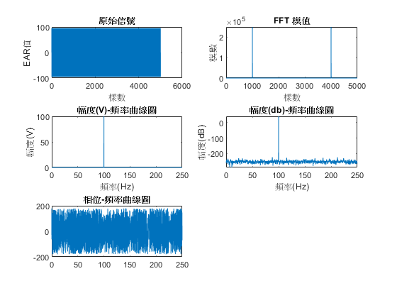

# fourier-transform
使用matlab進行傅立葉轉換

## fourier簡介
  
  * 是一種線性積分變換，用於信號在時域（或空域）和頻域之間的變換
  
  * 任何連續測量的時序或信號，都可以表示為不同頻率的正弦波信號的無限疊加
  
  * FFT:
  
    * 一階快速傅立葉變換函式

    * 直觀的看各頻率上的訊號強弱

    * 取樣定理:取樣頻率要大於訊號頻率的兩倍
 
## 程式介紹

  * 輸入:
    > Fs=500; %採樣頻率(Hz)
    
    > f=100 %信號頻率(Hz)
    
    > N=5000; %採樣點數
    
    > t=[0:1/Fs:N/Fs]; %採樣時刻
    
    > S=100*sin(2*pi*f*t); %信號

  * FFT變換:
    > Y = fft(S,N); %做FFT變換
    
    > Ayy = (abs(Y)); %取模
    
  * 注意:   
    由於FFT結果的對稱性，通常只會使用前半部分的結果，所以本程式輸出結果只呈現前半部分
    
    
## 輸出結果
  
